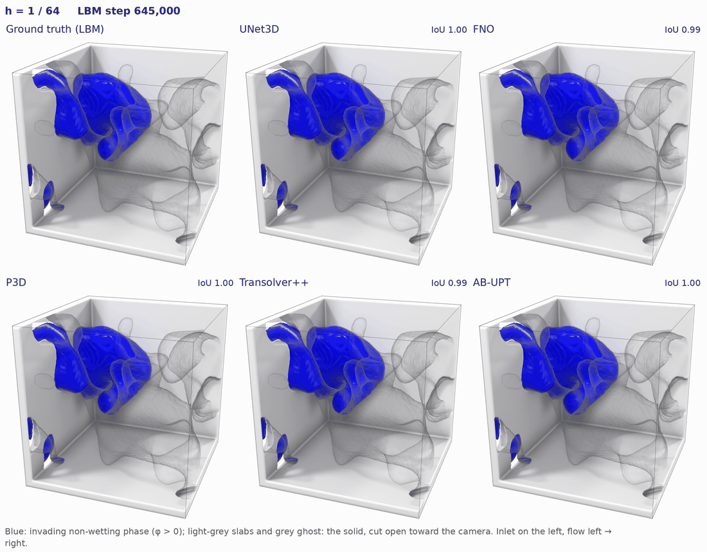

# PoreML

A benchmark for machine learning on pore-scale multiphase flow: 560 lattice-Boltzmann
trajectories in four campaigns (drainage, trapping, fuel-cell gas-diffusion layers, flip-chip
underfill), a next-frame forecasting task, five reference models, and an evaluation protocol
built on autonomous rollouts and physical descriptors — saturation, interface area, Euler
characteristic, meniscus curvature — rather than per-voxel error alone.

<p align="center">
  
</p>

*A 64-step autonomous rollout of drainage in a generated blob medium (M = 0.2, θ = 150°):
the lattice-Boltzmann ground truth beside the five reference models after push-forward
fine-tuning, each fed only its own predictions. IoU is that of the invading phase.*

This repository holds the tasks, models, metrics, training and evaluation. The data lives on
HuggingFace: [`PoreML/PoreML_data`](https://huggingface.co/datasets/PoreML/PoreML_data); the trained
weights are at [`PoreML/PoreML_checkpoint`](https://huggingface.co/PoreML/PoreML_checkpoint).

## Install

```bash
uv sync                      # Python 3.12, PyTorch (CUDA 12.8 wheels on Linux)
uv run poreml --help
```

Optional groups: `--group viz` (3-D renders), `--group curvature` (mesh descriptors),
`--group demo` (the notebook). `uv sync --group dev` installs everything plus pytest and ruff.

## Data

```bash
uv run poreml download --dry-run                          # what the dataset holds and how big it is (3.3 TB)
uv run poreml download --campaign drainage --size 128     # a slice: filters are --campaign, --family, --size, --run
uv run poreml download --split splits/gdl/gen.yaml        # exactly the runs one split names
uv run poreml download                                    # everything
```

The size of the selection is shown first and nothing is fetched until you agree. Files land
under `data/case`, the layout every config expects; rerunning resumes.

## Checkpoints

The trained weights of the whole matrix — 35 base trainings and their 35 push-forward
fine-tunes — are on HuggingFace:
[`PoreML/PoreML_checkpoint`](https://huggingface.co/PoreML/PoreML_checkpoint).

```bash
uv run poreml checkpoints --dry-run                                  # what is there and how big it is (7 GB)
uv run poreml checkpoints --phase train_push --which best_rollout    # the weights the paper reports
uv run poreml checkpoints --campaign drainage --model unet --kind gen
uv run poreml checkpoints                                            # everything
```

Filters are `--phase` (`train`, `train_push`), `--campaign`, `--model`, `--kind` (`gen`, `all`)
and `--which` (`best`, `last`, `best_rollout`); they intersect and each is repeatable. Runs land
under `case/train` and `case/train_push` as the run directories training would have written —
`config.yaml`, `run_meta.json`, `metrics.csv`, `train_log.csv`, `ckpts/*.pt` — so the push
configs' `train.init_from`, the transfer studies and `util/inference` find them as finished
runs, and `submit.py --dry-run` lists those cells as done. Score one directly:

```bash
RUN=$(ls -d case/train_push/drainage/unet_gen/ckpts/*/)
uv run poreml rollout -c $RUN/config.yaml --ckpt $RUN/ckpts/best_rollout.pt
```

Report `best.pt` for a base run and `best_rollout.pt` for a push-forward run. Optimiser state,
per-epoch candidates and stored frames are not published; `poreml inference|metric|render`
reproduce the latter from the weights.

## Demo

`demo/demo.ipynb` walks the whole workflow on two trajectories in about twenty minutes on one
GPU: download → train a 1 M-parameter UNet on all five fields → push-forward fine-tune → 64-step
rollouts on an unseen rock → figures. Both trainings are skipped when a finished run is already
there, so re-running it is quick.

```bash
uv sync --group demo
uv run jupyter lab demo/demo.ipynb
```

## Workflow

Every stage takes a YAML config that fully determines it — data and split, task, model,
optimiser, metrics, rollout protocol.

| Stage | Command | Writes |
|---|---|---|
| list runs | `poreml runs -c <config>` | status, geometry family, `M`, `theta` of every run |
| train | `poreml train -c <config> [--resume auto]` | a run directory: `config.yaml`, `run_meta.json`, `metrics.csv`, `ckpts/` |
| select | `poreml finalise <run_dir>` | `ckpts/best_rollout.pt`, the epoch with the best rollout, evaluated under `final/` (training does this itself when it ends) |
| one-step score | `poreml eval -c <config> --ckpt <ckpt>` | `results_<split>.json`, per-sample CSV |
| rollout | `poreml rollout -c <config> --ckpt <ckpt>` | `rollout_<split>.json`, every step scored |
| windowed rollouts (GPU) | `poreml inference -c <config> --ckpt <ckpt>` | `inference.csv` — error and forward time per window and step — and stored keyframes |
| all metrics on the keyframes (CPU) | `poreml metric -c <config> --ckpt <ckpt>` | `inference/metrics_<split>.{csv,json}` |
| render | `poreml render -c <config> --ckpt <ckpt> --run <id> --out-dir <dir>` | truth \| prediction frames and a GIF |

`poreml ls tasks|models|metrics` lists what is registered.

## Reproducing the benchmark

| Folder | What it runs |
|---|---|
| `configs/<campaign>/<model>_<kind>.yaml` | the training matrix: `unet3d`, `fno3d`, `p3d`, `transolver`, `abupt` × the `gen` (generated media) and `all` splits of each campaign |
| `case/train/` | trains the matrix as SLURM arrays — preemption-safe, resubmitting is the recovery procedure |
| `case/train_push/` | push-forward fine-tune of every finished training |
| `case/shift/`, `case/shift_push/` | Geo-Shift: models trained on generated media, tested on micro-CT geometries |
| `case/scale/`, `case/scale_push/` | Scale-Up: models trained at 128³, tested on 256³ domains |
| `util/` | everything around the studies: `download.py` and `download_checkpoints.py`, `inference/` (timed validation rollouts of every training), `configs/`, `convert/` and `release/` (how the dataset and the checkpoints were built and published), `archive/` (development history) |

Each folder has a README with its protocol. The SLURM workers take their partition and account
from the environment (`SBATCH_PARTITION`, `SBATCH_ACCOUNT`); every driver has `--dry-run`.

## Reading a result

- Only the **rock** span of the domain is scored; the inlet reservoir, porous plate and outlet
  buffer are boundary devices.
- Every metric is computed per sample, averaged **per run, then over runs**, so a number depends
  on neither the batch size nor how long each run is. Non-finite samples are counted, never dropped.
- Splits under `splits/` are frozen; a split may only name finished runs.
- Every artifact records its provenance: code version, metric version, split hash, precision, device.

## Adding to it

One file and one decorator; nothing in the core changes.

| Add a | Where | How |
|---|---|---|
| model | `src/poreml/models/<name>.py`, imported in `models/__init__.py` | `@MODELS.register("name")` on an `nn.Module` taking `in_channels`, `out_channels`; `representation = "points"` selects the point stream |
| task | `src/poreml/tasks.py` | `@TASKS.register("name")` on a class satisfying the `Task` protocol |
| descriptor | `src/poreml/metrics/descriptors.py` | `@descriptor("name", kind="scalar"\|"distribution")` on `(field, mask, **params) -> Tensor` |
| error | `src/poreml/metrics/errors.py` | `@error("name", accepts=(...), higher_is_better=...)` on `(pred, target) -> Tensor` |

## Development

```bash
just fixture    # a tiny synthetic dataset under tests/_data/tiny
just test       # pytest
just fmt        # ruff
```

## Licences

The model ports keep their upstream licences, listed in `NOTICE`: Transolver++ and FNO are MIT,
P3D is Apache-2.0, and AB-UPT (`src/poreml/models/abupt.py`, `upt.py`) follows the Emmi AI
Non-Production License — research and evaluation use only. The dataset is MIT-licensed, and so are the published
checkpoints except the `abupt` ones, which follow AB-UPT's licence.
